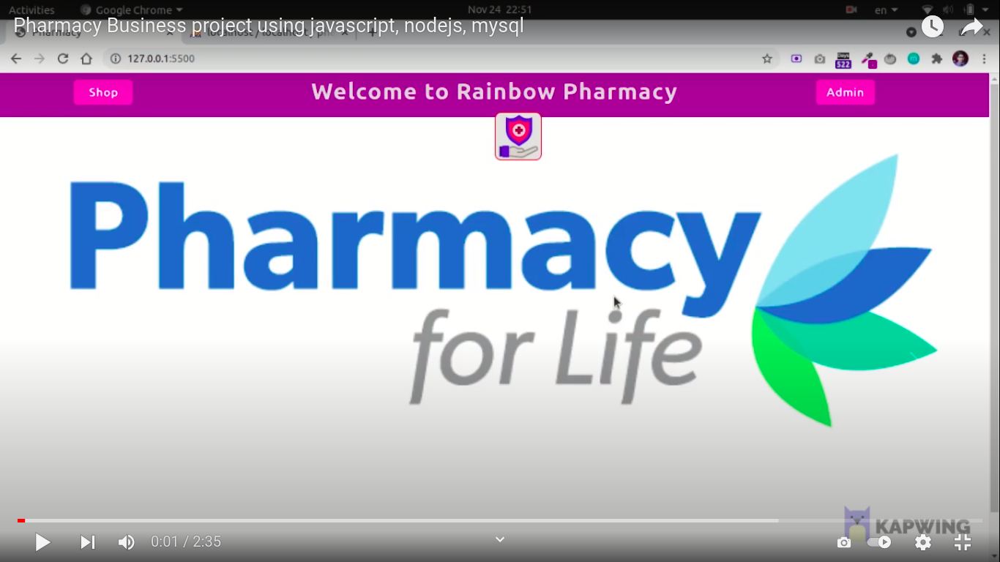

<h2>Basic Pharmacy Project</h2>

This project some basic functionality that shop owner can add medicine and see all history for buying products

 

Step 1: npm install

Step 2: node index.js or nodemon index.js

Step 3: For setup database, there is a pharmacy.sql file import this file into the MYSQL database

<h2> play the video </h2>

Video Link: https://www.youtube.com/watch?v=a70elcWAhTw
